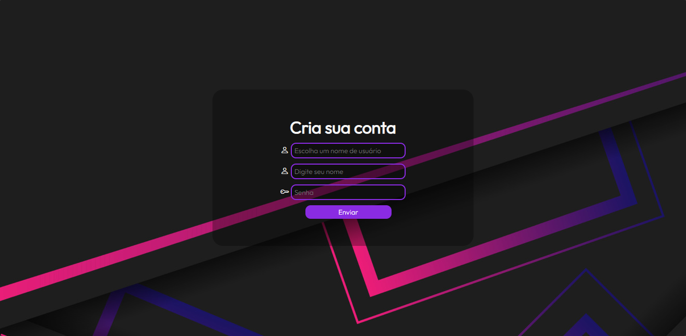
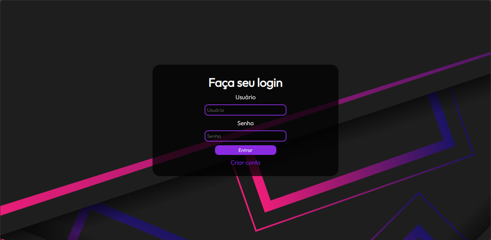
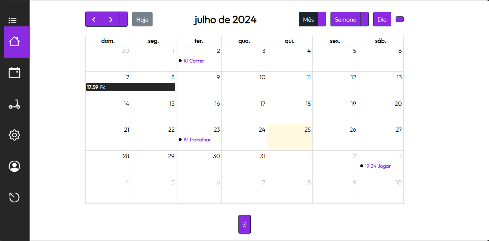
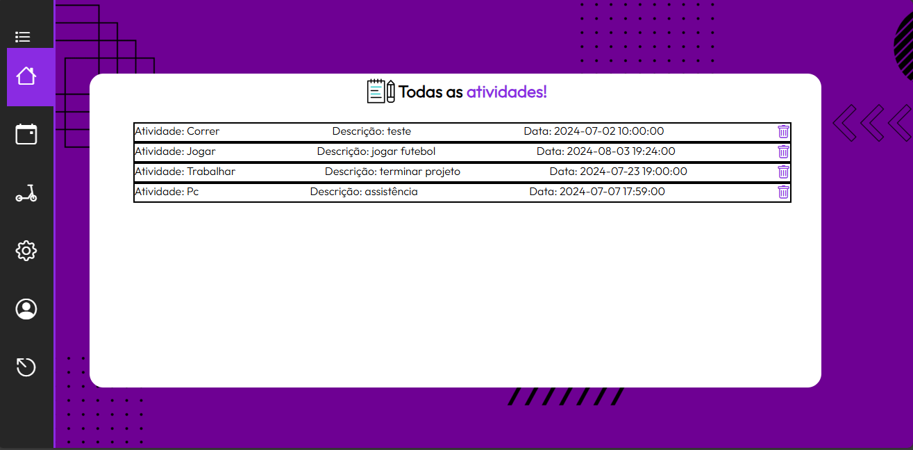
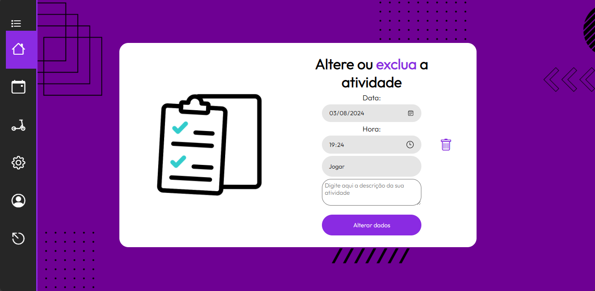
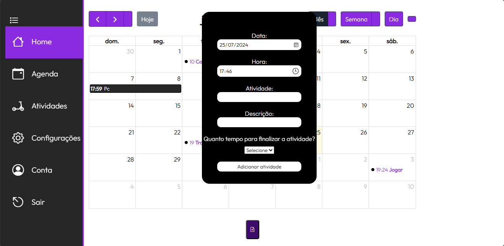

# Projeto NLcalendar

Projeto pessoal de uma agenda online!

feita com intuito de testar meus conhecimentos em **PhP**, **JavaScript** e **Bootstrap**.

## ⛏️Tecnologias ultilizadas
- JavaScript
- PHP
- Bootstrap
- HTML
- CSS

## Preview do projeto😁
### Tela de cadastro


### Tela de Login


### Tela Inicial


### Tela do calendário


### Tela com lista de atividades do usuário


### Tela de editar ou remover atividade do usuário


### Tela inicial mostrando menu lateral e botão de adicionar atividades



## 🕵️Como ultilizar
- Para ter acesso a plataforma **NLcalendar** você precisa criar um usuário e senha para fazer login.
- Após ter criado sua conta, faça o login e desfrute de tudo que o site tem a oferecer!
- Você pode criar atividades em um calendário e deixar registrado para não esquecer.
- Você pode editar ou remover sempre que quiser, sem contar que você pode estipular um tempo para finalizar determinada atividade.
- a **NLcalendar** te ajuda a organizar suas tarefas, gerencia-las e ter um melhor planejamento de seu tempo!

## 🖇️Clone o projeto
Observação: Tenha o Git instalado no seu computador. Caso não tenha, você pode baixar [aqui](https://git-scm.com/downloads).

#### 1 - URL do projeto
URL: https://github.com/NiivL/Agenda-Eletronica.git

2 - Abra o terminal e navegue até o diretório desejado:
```bash
cd /caminho/para/o/diretorio
```
3 - Clone o repositório:
```bash
git clone https://github.com/NiivL/Agenda-Eletronica.git
```

### Pronto, agora você pode contribuir com o projeto😊